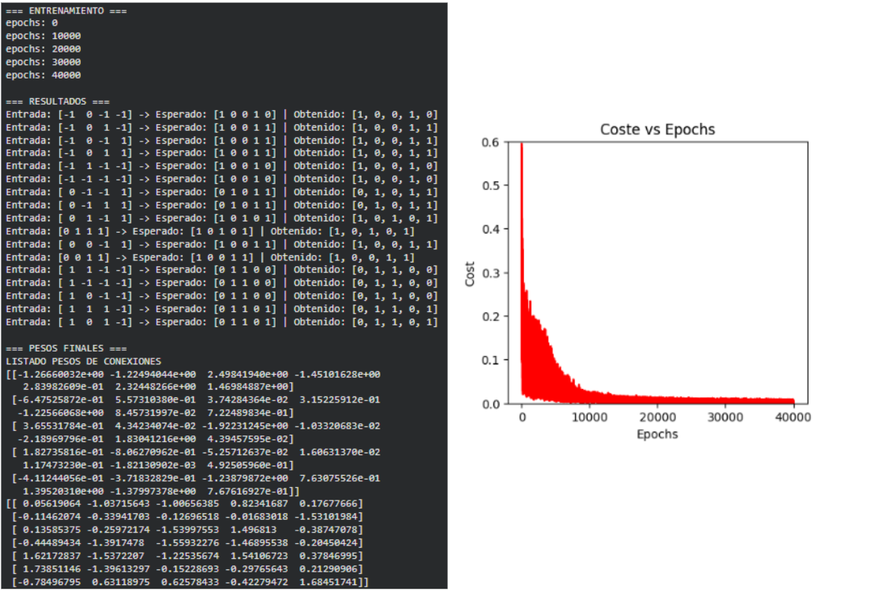

# Coche Arduino con Inteligencia Artificial

### 👥 Integrantes del Proyecto
- Rivieri Lautaro
- Montoro Federico

## 📋 Descripción del Proyecto
Este proyecto implementa una red neuronal en un coche Arduino para que pueda conducir de manera autónoma evitando obstáculos. El sistema utiliza machine learning para entrenar una red neuronal que controla los motores del coche, extendiendo la funcionalidad original con nuevas capacidades inspiradas en los AGV (Automated Guided Vehicles) utilizados en entornos industriales y logísticos.

## 🚀 Evolución del Proyecto
### Fase Inicial
- Red neuronal en Python con 2 entradas (distancia y posición del obstáculo) y 4 salidas (control de 4 motores).
- Entrenamiento con 9 patrones de entrada.
- Transferencia de los pesos de la red a Arduino para la propagación hacia adelante.
- Arquitectura: `[2, 3, 4]` con función de activación tanh

### Fase Mejorada
#### Nuevas Entradas
1. **Sensor de Peso**: Detecta si el coche lleva un paquete.
   - `-1`: Sin paquete
   - `1`: Con paquete

2. **Sensor de Línea**: Detecta si el coche debe seguir una línea.
   - `-1`: No sigue línea
   - `1`: Sigue línea

#### Nueva Salida
- **LED**: Indicador luminoso.
   - `0`: Apagado
   - `1`: Encendido

### ⚙ Arquitectura de la Red Neuronal
1. **Arquitectura Original**
- **Red Neuronal:** `[2, 3, 4]` (2 entradas, 3 ocultas, 4 salidas)
- **Entradas:** Distancia y Posición del obstáculo
- **Salidas:** Control de 4 motores DC
- **Función de Activación:** Tangente hiperbólica (tanh)

2. **Arquitectura Extendida**
- **Capas**: `[4, 6, 5]` (4 entradas, 6 neuronas en la capa oculta, 5 salidas)
- **Función de activación**: Tangente hiperbólica (tanh)
- **Rango de entrada**: [-1, 1]
- **Rango de salida**: [-1, 1] (luego se redondea a 0 o 1)

### 👥 Tablas de Verdad por miembro del equipo

#### Rivieri Lautaro
**Lógica del LED**: Se enciende cuando hay peso o cuando está siguiendo una línea.

* 16 patrones de entrenamiento
* Comportamiento estándar para obstáculos
* LED como indicador multifuncional

**Ejemplos de patrones:**

`[-1, 0, -1, -1]` → `[1,0,0,1,0]` # Avanzar, LED apagado

`[-1, 0, 1, -1]` → `[1,0,0,1,1]` # Avanzar, LED encendido (peso)

`[-1, 0, -1, 1]` → `[1,0,0,1,1]` # Avanzar, LED encendido (línea)

**Entrenamiento:** Ejecución dentro de Google Colab

#### Montoro Federico
**Lógica del LED**: Se enciende solo cuando hay peso, independientemente de la línea.
16 patrones de entrenamiento

- Comportamiento conservador con peso
- Comportamiento agresivo siguiendo línea
- LED como indicador de carga

**Ejemplos de patrones:**

`[-1, 0, -1, 1]` → `[1,0,0,1,0]` # Avanzar rápido, sin LED

`[-1, 0, 1, 1]` → `[1,0,0,1,1]` # Avanzar lento, con LED (peso)

`[1, 0, 1, -1]` → `[0,0,0,0,1]` # Parar con LED

**Entrenamiento:** Ejecución dentro de Google Colab

## 🎯 Enfoques de Resolución de Problemas
### 🔍 Aprendizaje Supervisado
- Dataset estructurado con patrones de entrenamiento
- Entradas normalizadas (-1 a 1)
- Salidas binarias para control discreto

### 🧩 Descomposición Modular
- **Capa Sensorial**: Adquisición de datos
- **Capa Cognitiva**: Procesamiento con RNA
- **Capa Motora**: Ejecución de acciones

### 🔄 Transferencia de Conocimiento
- Entrenamiento offline en Python
- Implementación embebida en Arduino
- Solo forward propagation en ejecución

### ⚡ Optimización de Recursos
- Minimalismo computacional
- Eficiencia energética
- Hardware estándar y accesible

### 📊 Normalización de Datos
- Entradas y salidas normalizadas en el rango [-1, 1]
- Función de activación tanh para mejor convergencia

### 🔁 Backpropagation
- Algoritmo de entrenamiento para ajustar los pesos
- Monitorización del coste durante el entrenamiento

## 📁 Código
El repositorio contiene los siguientes archivos:

- Red neuronal original con 2 entradas y 4 salidas.
   - `red_neuronal_original.ipynb`
- Red neuronal modificada con 1 tabla de verdad nueva por cada miembro
   - `red_neuronal_rivieri.ipynb`
   - `red_neuronal_montoro.ipynb`

## 🎯 Logros Principales
- Sistema de navegación autónoma basado en RNA
- Extensión AGV exitosa con sensores industriales
- Implementación eficiente en plataforma embebida
- Estrategias operacionales diferenciadas por miembro
- Comportamientos adaptativos según contexto logístico

## ✨ Futuras Mejoras
- Sensores adicionales: temperatura, humedad, inclinación
- Actuadores extendidos: buzzer, displays, más LEDs
- Comunicación WiFi para monitoreo remoto y telemetría
- Sistema de localización indoor (IMU, odometría)

---

- **Corto Plazo (1-3 meses)**
   - Comunicación multi-AGV para flotas
   - Sistema de localización inercial
   - Optimización dinámica de rutas

- **Medio Plazo (3-6 meses)**
   - Integración con sistemas ERP
   - Sensores de temperatura/humedad para carga sensible
   - Sistema de carga automática

- **Largo Plazo (6+ meses)**
   - Aprendizaje por refuerzo para mejora continua
   -    omputer vision para navegación avanzada
   - Integración con IoT industrial

### Bibliografía:

http://www.aprendemachinelearning.com/programa-un-coche-arduino-con-inteligencia-artificial/

